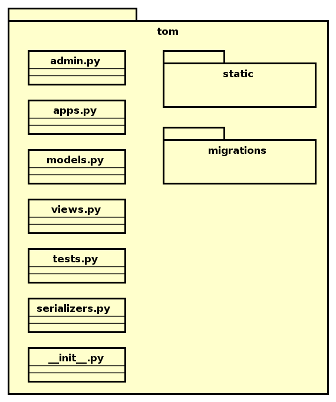
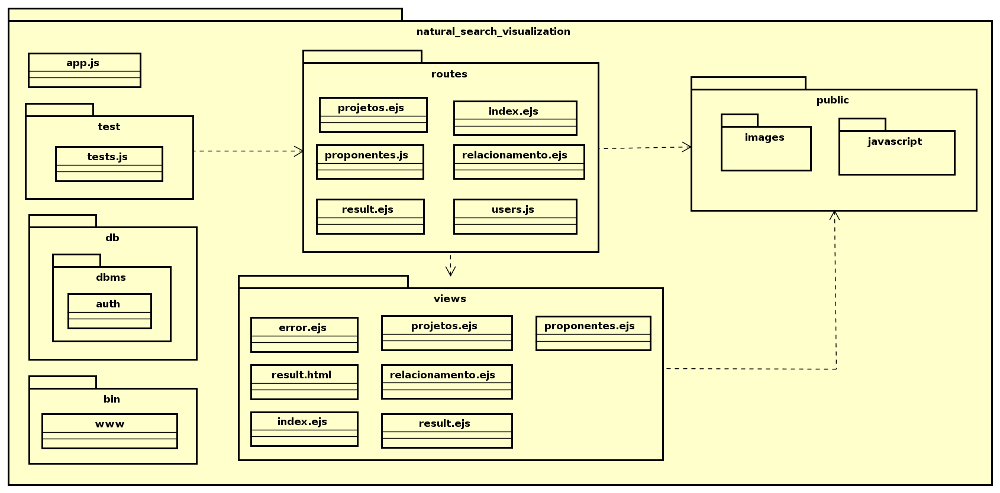
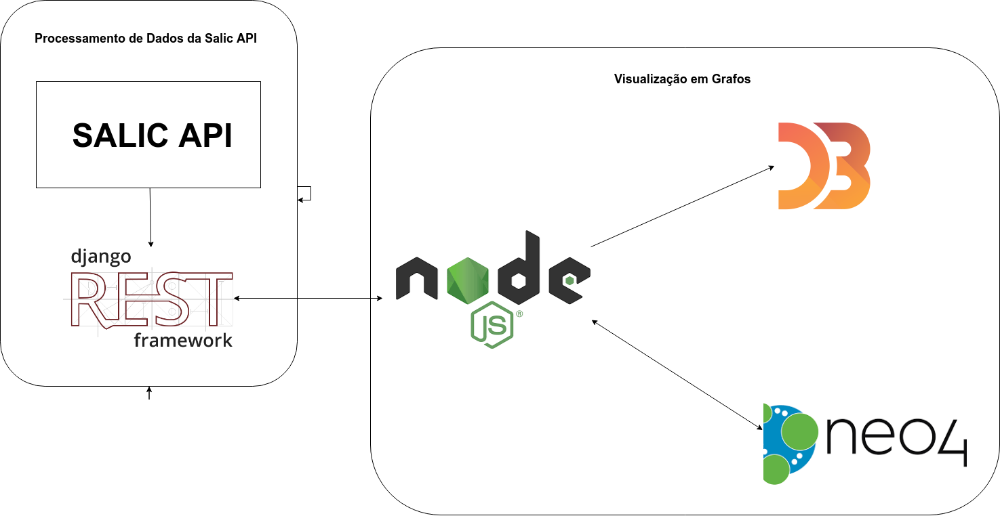
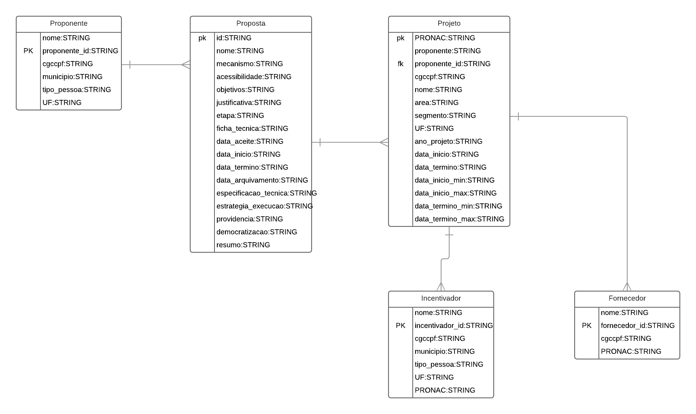

---
layout: default
---

# Documento de Arquitetura

## Histórico de Revisão

|           Data          |         Versão         |       Descrição   |         Autores   |
|:----------------------:|:------------------------:|:---------------------:|:--------------:|
| 30/08/2018         |           0.1                | Abertura de documento | [Adrielly Rodrigues de Jesus](https://github.com/drykette), [Fabiana Luiza V. P. Ribas](https://github.com/FabianaRibas), [Gustavo Duarte Moreira](https://github.com/gustavoduartemoreira), [Marcos Vinícius Rodrigues da Conceição](https://github.com/marcos-mv), [Michel Martins de Camargo](https://github.com/micheldcamargo), [Mikhaelle de Carvalho Bueno](https://github.com/Mikhaelle); |
| 05/09/2018 | 0.2 | Definição de metas e restrições de arquitetura |[Michel Martins de Camargo](https://github.com/micheldcamargo) |
| 05/09/2018 | 0.3 | Definição dos itens 1.1.3, 1.1.4 / Criação do item 2, Adição de referências  |[Gustavo Duarte Moreira](https://github.com/gustavoduartemoreira)|
| 09/09/2018 | 0.4 | Definição dos itens 2.1, 2.1.1, 2.1.2, 2.1.3 |[Mikhaelle de Carvalho Bueno](https://github.com/Mikhaelle)|
| 11/09/2018 | 0.5 | Criação do item 3, Correção dos links das referências  |[Gustavo Duarte Moreira](https://github.com/gustavoduartemoreira)|
| 15/09/2018 | 0.6 | Atualizando do layout, descrição dos tópicos 2.2,2.3,2.4,2.5, atualização do item 3.1 |[Mikhaelle de Carvalho Bueno](https://github.com/Mikhaelle)|
| 11/09/2018 | 0.7 | Adição das restrições do projeto, Atualização dos tópicos 1.1, 1.2, 1.4  |[Gustavo Duarte Moreira](https://github.com/gustavoduartemoreira)|
| 27/09/2018 | 0.8 | Alteração da representação da arquitetura, Atualização dos tópicos 2, 2.1 |[Michel Martins de Camargo](https://github.com/micheldcamargo)|
| 29/09/2018 | 0.9 | Alteração da representação da arquitetura, Atualização dos tópicos 2.4, 2.5, 2.6, 2.7 |[Marcos Vinícius Rodrigues da Conceição](https://github.com/marcos-mv)|
| 01/10/2018 | 1.0 | Alteração da representação da arquitetura, supressão tópico 2.7. Alteração tópico 3.1 |[Marcos Vinícius Rodrigues da Conceição](https://github.com/marcos-mv), [Michel Martins de Camargo](https://github.com/micheldcamargo), [Filipe Barcelos](https://github.com/FilipeKN4) |
| 01/10/2018 | 1.1 | Adição das seções 5 e 6. Desrição da Arquitetura de Microserviços | [Filipe Barcelos](https://github.com/FilipeKN4) |
| 02/10/2018 | 1.2 | Atualização do item 2.4 e Adição e descrição do item 4.2.| [Marcos Vinícius Rodrigues da Conceição](https://github.com/marcos-mv) |
| 23/11/2018 | 1.3 | Refatoração do documento para adequar as alterações da arquitetura. | [Michel Martins de Camargo](https://github.com/micheldcamargo) |
| 26/11/2018 | 1.4 | Incluindo diagramas de pacotes do projeto. | [Michel Martins de Camargo](https://github.com/micheldcamargo) |

## Sumário

1. [Introdução](#1)      
    * 1.1 [Finalidade](#1.1)
    * 1.2 [Escopo](#1.2)   
    * 1.3 [Definições, acrônimos e abreviações](#1.3)
    * 1.4 [Visão Geral](#1.4)

2. [Representação da Arquitetura](#2)
    * 2.1 [Django Rest](#2.1)
    * 2.2 [Salic API](#2.2)
    * 2.3 [Node.js](#2.3)
    * 2.4 [Neo4J](#2.4)
    * 2.5 [D3.js](#2.5)

3. [Metas e Restrições de Arquitetura](#3)        
    * 3.1 [Ambiente e Ferramentas de Desenvolvimento](#3.1)

4. [Visão Lógica](#4)       
    * 4.1 [Pacotes Natural Search(API)](#4.1)
        * 4.1.1 [View](#4.1.1)
        * 4.1.2 [Model](#4.1.2)
        * 4.1.3 [Test](#4.1.3)
        * 4.1.4 [Serializers](#4.1.4)
    * 4.2 [Pacotes Natural Search Visualization](#4.1)
        * 4.2.1 [View](#4.1.1)
        * 4.2.2 [Routes](#4.1.2)
        * 4.2.3 [Test](#4.1.3)

5. [Arquitetura dos Serviços e visão de Implementação](#5)
    * 5.1 [Visão Geral](#5.1)
    * 5.2 [Micro Serviços e Camadas](#5.2)
        * 5.2.1 [Processamento de Dados da Salic API](#5.2.1)
        * 5.2.2 [Visualização em Grafos](#5.2.2)

6. [Visão de Dados](#6)                  

7. [Referências](#7)

## 1. Introdução

### 1.1 Finalidade

O objetivo deste documento é fornecer uma visão geral e abrangente arquitetural do sistema **NaturalSearch** . Ele deve mostrar de forma clara e objetiva as decisões arquiteturais que foram tomadas em relação ao projeto, fornecendo as informações necessárias para desenvolvedores e demais envolvidos em termos de estrutura da aplicação e tecnologias utilizadas.

### 1.2 Escopo   

Este documento foi construído sobre a visão da arquitetura utilizada na implementação do sistema **NaturalSearch**, de forma a explicitar as decisões estabelecidas. Nele serão descritos os padrões arquiteturais adotados, _frameworks_ escolhidos para o desenvolvimento do projeto. Com o objetivo de fornecer novas formas de vizualização das propostas e projetos culturais que recebem incentivos fiscais do Ministério da Cultura por meio da Lei Rouanet. A finalidade é auxiliar a fiscalização e proporcionar uma maior transparência com os gastos do dinheiro público.

### 1.3 Definições, acrônimos e abreviações

* API - Application Programming Interface;
* MVT - Model-View-Template;
* MVC - Model-View-Controller;<!-- * LN - Linguagem Natural; -->
* SALIC - Sistema de Apoio às Leis de Incentivo à Cultura.

### 1.4 Visão Geral

Este documento traz o detalhamento, a descrição e as principais características da arquitetura adotada pela equipe de desenvolvimento visando oferecer o melhor desempenho para o projeto **NaturalSearch**. Nele estará presente: Representação da Arquitetura, Metas e Restrições de Arquitetura, Visão Lógica, Visão de Implementação, Visão de Dados e Referências bibliográficas.

## 2. Representação da Arquitetura

Para o projeto será adotada a arquitetura baseada em componentes. Nesta abordagem o foco está na decomposição dos sistemas possibilitando a reusabilidade, substituição, encapsulamento, independência. O projeto será dividido em duas partes, a primeira consta em uma API rest desenvolvida com base no framework Django Rest que deve tratar os dados recebidos da API SALIC e armazená-los em uma base de dados orientada a grafos(Neo4j). A segunda parte trata do front-end e da exibição destes dados e utiliza as ferramentas NodeJs e D3 para tratar e exibir os dados recuperados do banco de dados orientado a grafos.

Os dados são tratados na API e salvos na base de dados do Neo4J. O segundo serviço contempla o tratamento dos dados do banco de dados gerando arquivos json de acordo com as pesquisas realizadas, no formato compatível com o D3.js para a visualização em forma de grafos.  

### 2.1. Django REST
A API NaturalSearch será uma aplicação desenvolvida a partir do framework Django REST, utilizando linguagem python. Um framework já contém um conjunto de componentes que são normalmente utilizados pela maioria dos desenvolvedores o que ajuda a desenvolver uma aplicação de forma mais rápida, eficiente e organizada.

A arquiteura do Django REST é baseada no modelo arquitetural REST(Representational State Transfer) que utiliza os métodos do protocolo HTTP de requisitção e resposta onde o foco são os recursos. O modelo REST entrega alta performance e escalabilidade e ainda pode ser utilizado por praticamente qualquer cliente imprimindo interoperabilidade, o que é um recurso importante para o projeto.

A API rest recebe requisições HTTP de um cliente e executa o que a requisição solicita. A API então envia uma resposta ao cliente, normalmente através dos formatos XML ou JSON. Esta dinâmica é demonstrada na imagem a seguir.

Fonte: https://tutorialedge.net/general/what-is-a-rest-api/

### 2.2. Salic API
A API utilizada para popular o nosso banco de dados será a [API Salic](http://api.salic.cultura.gov.br/doc/). Essa API acessa os dados do portal [Salic](http://rouanet.cultura.gov.br/), que é um sistema que reúne dados de propostas e projetos do Ministério da Cultura relacionados a Lei Rouanet. Serão usados os dados de projetos e propostas que serão exportados no formato *HAL+JSON*. Haverá uma integração continua do banco de dados com a API do salic.

<!-- ### 2.3. TensorFlow
O TensorFlow é uma biblioteca open source de _machine learning(ML)_ para pesquisa e produção que será utilizada no projeto para relacionamentos de similaridade e aplicação de Linguagem Natural. Isso será necessário para o tratamento do banco de dados, o que permitirá o retorno das relações entre os projetos e propostas em forma de grafos para o usuário. -->

### 2.3. Node.js
O Node.js é uma plataforma construída sobre o motor JavaScript do Google Chrome (V8) para facilmente construir aplicações de rede rápidas e escaláveis. Node.js usa um modelo de I/O direcionada a evento não bloqueante que o torna leve e eficiente, ideal para aplicações em tempo real com troca intensa de dados através de dispositivos distribuídos.

 Utilizamos o NodeJS como uma plataforma back-end que permite executarmos scripts Javascript no lado do servidor para acessar e trabalhar de maneira extremamente rápida com o grande volume de dados em formato JSON que serão coletados da API SALIC. O fato de não possuir dependências ajuda bastante no processo de desenvolvimento, deploy e integração contínua do código já que com apenas o Node instalado na máquina já se pode desenvolver qualquer aplicação.
 
  Levando em conta o tempo disponível para a conclusão da aplicação o NodeJS atendeu todas a nossas demandas economizando o tempo de aprendizado que seria necessário com outras outras linguagens como por exemplo PHP ou RUBY. 
  
  A forma com que o Node.JS gerencia os requests através de um looping de eventos permite que a aplicação trabalhe em paralelo, de forma assíncrona e como nossa aplicação demanda muita leitura de arquivos e manipulação na base de dados, com IO não-bloqueante do Node.js essas tarefas são facilmente executadas em background e o retorno de sucesso ou falha dessas tarefas ocorrem através de uma função de callback.

Fonte: https://blog.rocketseat.com.br/nodejs-vale-a-pena-vantagens/

### 2.4. Neo4J
O Neo4j é um banco de dados Open Source baseado no conceito NoSQL (Banco de Dados que não utiliza os conceitos estruturados). As informações não são armazenadas em tabelas, mas sim na forma de Grafos e suas estruturas são representadas pelos conceitos matemáticos da Teoria de Grafos. Neste tipo de Banco de Dados, os registros são gravados em vértices (nós) que possuem propriedades definidas conforme a necessidade. Estes vértices por sua vez se relacionam com outros vértices através de arestas (arcos) que se interligam criando caminhos entre os vértices de maneira organizada com relações explícitas. <!-- Dessa forma será possível integrar metodologias de pesquisa com linguagem natural utilizando a biblioteca Tensorflow e entregar para o usuário dados com um melhor grau de relacionamento entre si. -->

### 2.5. D3.js

D3 ou (Data-Drive-Documents) é um biblioteca do javascript com a função de organizar e mostrar dados dinamicamente em forma gráfica. Através dele o usuário poderá visualizar os relacionamentos entre sua pesquisa com outros dados de forma intuitiva com a utilização dos grafos, facilitando a visualização das relações entre os dados.

## 3. Metas e Restrições de Arquitetura       
O projeto **NaturalSearch** possui as seguintes metas:

* Funcionar nos  principais browsers utilizados atualmente: Mozilla Firefox, Google Chrome e Internet Explorer.
* O código deve ser modularizado facilitando a manutenção e com baixo acoplamento.

**Restrições**

* Conexão com a internet;
* Utilização de banco de dados orientado a Grafos;
* Utilização do SALIC API;
* Os dados aprenstados são consultados apenas na base do Sistema de Apoio às Leis de Incentivo à Cultura - SALIC;

### 3.1. Ambiente e Ferramentas de Desenvolvimento

| Requisito | Ferramenta/Solução | Versão | Descrição |
|---|---|---|---|
|Linguagem| Python | 3.6 | Linguagem de programação de alto nível, orientada a objetos, interpretada e imperativa. |
|Framework| Django REST | 3.8 | Framework para desenvolvimento de API REST rápido de alto nível escrito em python. |
|Framework| Node.js | 8.12 | Framework para desenvolvimento web de alto nível escrito em python. |
|Biblioteca| D3.js | 4 | Biblioteca javascript para exibição de dados dinâmicos e interativa. |
|Plataforma| Web - Navegadores Google Chrome, Safari e Firefox | -- | -- |
|Virtualização| Docker | 18.03.1-ce | O Docker fornece uma camada adicional de abstração e automação de virtualização de nível de sistema operacional. |
|Virtualização| Docker-compose | 1.22.0 |  Ferramenta para a criação e execução de múltiplos containers de aplicação da Docker. |
|Base de dados| API Salic | -- | API aberta para acesso aos dados do portal SALIC. |
|Base de dados em grafos| Neo4J | 3.0 | Base de dados orientada a grafos |

<!-- |LN| TensorFlow | r1.10 | Biblioteca para aplicação de Linguagem Natural. | -->

## 4. Visão Lógica    

Pacotes de Design Significativos do Ponto de Vista da Arquitetura.

### 4.1. Pacotes Natural Search(API) 

#### 4.1.1. View
A View será responsável por gerenciar os comportamentos da aplicação e os dados.

#### 4.1.2. Model
A Model identifica as entidades a serem utilizadas na aplicação de maneira correlacionada com conceitos abstraídos das circunstâncias apresentadas no mundo real. Nessa camada também é implementado a comunicação com o banco de dados.

#### 4.1.3. Test
Os testes utilizados serão o de unidade e integração para garantir a qualidade do software entregado. 

#### 4.1.4. Serializers
Serialização é o processo de conversão de um objeto em um fluxo de bytes para armazenar o objeto ou fluxo na memória, em um banco de dados, ou em um arquivo, ou transmití-lo por uma conexão de rede, seja em forma binária ou em formato de texto como o JSON. Sua finalidade principal é salvar o estado de um objeto para ser capaz de recriá-lo quando necessário. Logo é um método simples e robusto para tornar objetos persistentes.

### 4.2. Pacotes Natural Search Visualization

#### 4.2.1. View
A View é a camada responsável pelos arquivos responsáveis por gerar o layout do sistema. Tem como objetivo processar a lógica da interface do sistema.

#### 4.2.2. Routes
Responsável por endereçar a lógica utilizando uma interface de comunicação baseada no protocolo HTTP. Processo realizado através do roteamento que determina como um aplicativo responde a uma solicitação do cliente, que vem através de um URI (caminho) e um método de solicitação HTTP específico (ex: GET, POST). Uma rota pode ter uma ou mais funções que são executadas quando a solicitação corresponde com o endereçamento da rota.

#### 4.2.3. Test
Os testes utilizados serão o de unidade e integração para garantir a qualidade do software entregado.

## 5. Arquitetura dos Serviços e visão de Implementação

Essa seção oferece a visão arquitetural dos micro-serviços implementados na construção do produto.

### 5.1. Visão Geral 

### 5.2. Microserviços e Camadas

Segue o detalhamento dos microserviços implementados no projeto, bem como as justificativas para suas escolhas.

#### 5.2.1 Processamento de Dados da Salic API

Primeiro microserviço do produto que possui arquitetura no padrão MVT, utilizando o _framework_ Django _Rest_. É utilizada com os objetivos de puxar os dados da Salic API e realizar o tratamento de forma a definir as categorias de projetos e propostas e classificá-las, assim, obtendo as relações de semelhança entre todas elas. <!-- Para a realização desse processamento de dados é utilizada a biblioteca de _Machine Learning_ _TensorFlow_. --> Esse serviço possibilita ao produto a realização do processamento de dados de forma independente da visualização.

#### 5.2.2 Visualização em Grafos

Segundo microserviço implementado no projeto com a utilização do _framework_ Node.js. Esse serviço recebe os dados processados no Django _Rest_ e popula o banco de dados com o objetivo de gerar arquivos _json_ compatíveis com a biblioteca D3.js, para que, assim, possa gerar a visualização em grafos dos projetos e propostas de acordo com a pesquisa realizada pelo usuário. Além disso, nesse serviço é implementado o front-end do produto por completo.
 
## 6. Visão de Dados

Essa seção descreve o modelo de dados oferecido pela Salic API para a construção dos relacionamentos e visualiação do projeto.

## 7. Referências
ARTEFATO: DOCUMENTO DE ARQUITETURA DE SOFTWARE. FUNPAR. Disponível em: <http://www.funpar.ufpr.br:8080/rup/process/artifact/ar_sadoc.htm>. Acesso em: 04 de Setembro de 2018.

WIKIPEDIA: Engenharia de software baseada em componentes. Disponível em: <https://pt.wikipedia.org/wiki/Engenharia_de_software_baseada_em_componentes>.  Acesso em: 04 de Setembro de 2018.

DJANGO: DOCUMENTAÇÃO DO DJANGO: <https://docs.djangoproject.com/pt-br/2.1/>. Acesso em: 05 de Setembro de 2018.

Node.js: estruturando suas aplicações. Disponível em:<https://imasters.com.br/front-end/node-js-estruturando-suas-aplicacoes> Acesso em: 23 de novembro de 2018.

PADRÕES ARQUITETURAIS MVC X ARQUITETURA DO DJANGO. GITHUB. Disponível em: <https://github.com/fga-gpp-mds/A-Disciplina/wiki/Padr%C3%B5es-Arquiteturais---MVC-X-Arquitetura-do-Django>. Acesso em: 09 de Setembro de 2018.

DJANGO MODELS. Disponível em: <https://django-portuguese.readthedocs.io/en/1.0/topics/db/models.html>. Acesso em: 09 de Setembro de 2018.

TENSORFLOW: AN OP MACHINE LEARNING LIBRARY. Disponível em : <https://www.tensorflow.org/?hl=pt-br>. Acesso em: 14 de Setembro de 2018.

NODE.JS: DOCUMENTAÇÃO DO NODE: <https://nodejs.org/en/docs/>. Acesso em 29 de Setembro de 2018.

MEDIUM: What exactly is Node.js?  Disponível em: <https://medium.freecodecamp.org/what-exactly-is-node-js-ae36e97449f5>. Acesso em 30 de Setembro de 2018. 

Express: Basic routing. Disponível em: <http://expressjs.com/en/starter/basic-routing.html> Acesso em: 23 de novembro de 2018.